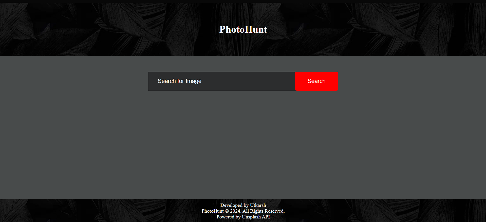
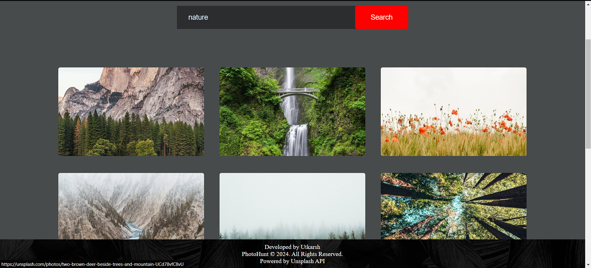

---

# PhotoHunt - Photo Search Engine

**PhotoHunt** is a simple web-based image search engine that allows users to search for images using the [Unsplash API](https://unsplash.com/developers). Users can enter a keyword, and the application will fetch images related to that keyword. The application also includes a "Show More" button to load additional images.

## Features

- **Search for Images:** Users can search for images by entering a keyword.
- **Load More Results:** Fetches additional images upon clicking the "Show More" button.
- **Responsive Design:** The layout is responsive and adapts to different screen sizes.
- **Unsplash Integration:** Powered by the Unsplash API for high-quality, free images.
- **Customizable:** Modify the styles and functionality as needed.

## Project Structure

```plaintext
.
├── index.html         # Main HTML file for the web app
├── style.css          # CSS file for styling
├── script.js          # JavaScript file containing functionality
└── img2.jpg           # Background image for the navbar and footer
```

## Setup and Usage

### Prerequisites
- You will need a valid **Unsplash API Access Key**. Sign up [here](https://unsplash.com/developers) to get one.

### Steps to Run

1. Clone the repository:
   ```bash
   git clone https://github.com/Utkarsh-1129/PhotoHunt-Photo-Search-Engine.git
   cd PhotoHunt-Photo-Search-Engine
   ```

2. Open the `index.html` file in your web browser.

3. Replace the `accessKey` in `script.js` with your Unsplash API key:
   ```javascript
   const accessKey = "YOUR_ACCESS_KEY";
   ```

4. Search for any keyword to see relevant images fetched from the Unsplash API.

### Example
- Enter "nature," "technology," or any other keyword in the search box and press "Search."
- Click the "Show More" button to load more results.

## Technologies Used

- **HTML5:** For structuring the webpage.
- **CSS3:** For styling and layout.
- **JavaScript (ES6+):** For interacting with the Unsplash API and handling the image search functionality.
- **Unsplash API:** Provides free access to high-quality images.

## Screenshots





## License

This project is licensed under the MIT License - see the [LICENSE](LICENSE) file for details.

## Acknowledgments

- [Unsplash](https://unsplash.com) for providing the API to access high-quality, free images.
- **Developed by Utkarsh Trivedi.**


---
